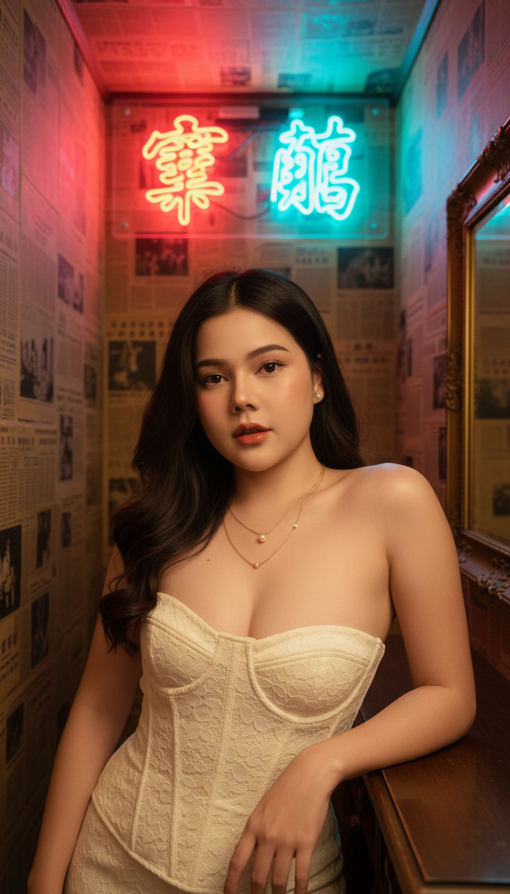

# AI Generated Image

## Details
- **Prompt:** `Ultra-photorealistic cinematic portrait, 8K sharpness, vertical 9:16. Preserve the exact face identity from the uploaded reference photo — 100% locked facial structure. A beautiful young Asian woman, early 20s, with delicate features, high cheekbones, full lips, and dark, long wavy hair styled with a side part, a few strands falling across her face. She has subtle makeup with defined brows and warm peachy-red lipstick. Wearing a form-fitting, strapless corset-style top or dress in creamy white lace, accentuating her figure. She wears small pearl stud earrings and two layered delicate gold necklaces, one with a small pearl pendant and the other with tiny gold beads. None. She leans elegantly on a dark wooden table or counter. The background is a narrow, enclosed room with walls completely covered in old, faded newspaper clippings. Above her head are two vibrant neon signs displaying Chinese characters, one glowing red and the other glowing blue/teal. A vintage rectangular mirror with an ornate frame is visible on the right wall. The composition is a medium shot, from waist up, capturing her confident pose. Atmospheric and moody lighting, primarily from the colorful neon signs casting a soft red and blue glow from above, subtly illuminating her face and the detailed lace of her outfit. Soft, warm ambient light on her skin. Cinematic portraiture, fashion editorial, neo-noir aesthetic, vintage Hong Kong vibe, high contrast, sharp focus on the subject.`
- **Category:** Nhân vật
- **Source Image:** [View Source](https://raw.githubusercontent.com/lenzcomvth/ImageLibrary/main/Female.png)

## Image
