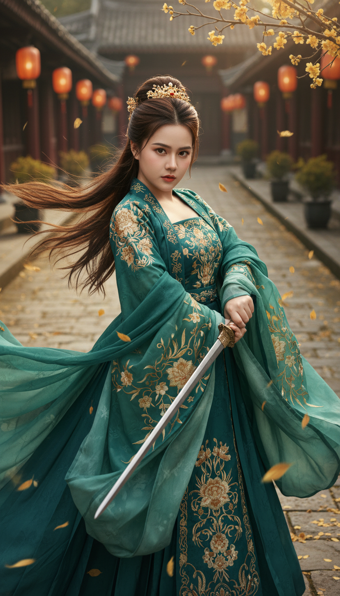

# AI Generated Image

## Details
- **Prompt:** `Ultra-photorealistic cinematic portrait, 8K sharpness, vertical 9:16. Preserve the exact face identity from the uploaded reference photo — 100% locked facial structure. A young adult female, 20s, with a captivating, intense gaze and a determined expression. She has symmetrical features, dark brown eyes, and perfectly arched eyebrows. Her long, dark brown hair is styled in an elegant high bun, with loose strands framing her face and flowing dynamically to the left, conveying movement. She wears minimal, natural makeup. A voluminous and flowing traditional Chinese Hanfu dress in rich teal and jade green, adorned with intricate gold floral and vine-like embroidery patterns across the fabric. A magnificent gold ornate crown/hairpiece sits atop her high bun. She firmly holds a long, polished silver-colored sword across her body. Golden autumn leaves and petals are gracefully falling around her and scattered on the stone ground. Branches with delicate golden flowers and leaves are visible near her. A high-angle, medium shot looking down at the subject in a dynamic pose on an ancient Chinese stone-paved street or courtyard. Traditional Chinese buildings with dark tiled roofs, red pillars, and glowing orange lanterns line the background, slightly blurred with a beautiful bokeh effect. Warm, soft natural light, possibly golden hour, illuminating her from the top-right, creating subtle highlights on her hair, skin, and the flowing fabric, casting soft shadows. Ethereal, elegant, historical fantasy, Wuxia film aesthetic, fashion photography, cinematic drama, intricate detail.`
- **Category:** Nhân vật
- **Source Image:** [View Source](https://raw.githubusercontent.com/lenzcomvth/ImageLibrary/main/Female.png)

## Image
